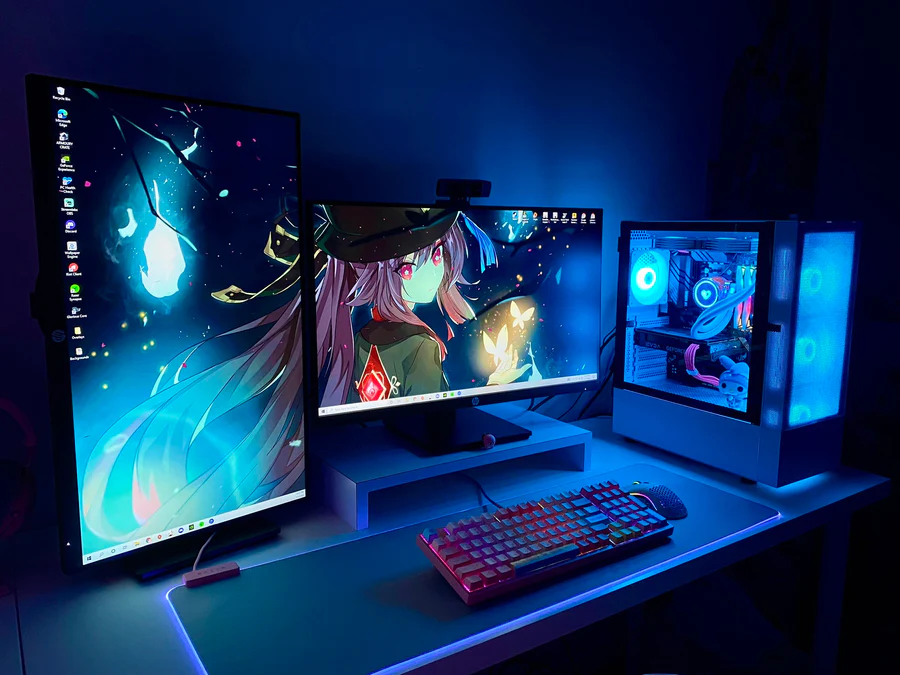
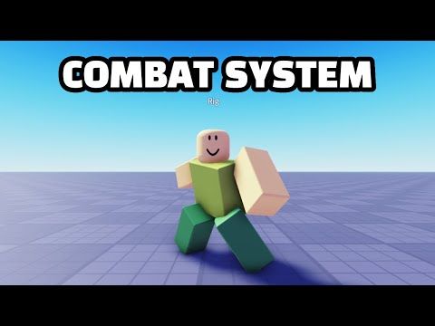

<!DOCTYPE html>
<html lang="en">
<head>
<meta charset="UTF-8">
<meta name="viewport" content="width=device-width, initial-scale=1.0">
<title>Your Portfolio</title>

</head>
<body>

  
  

    

      <h2 class="project-heading">Combat System Project</h2>
      
      
A dynamic combat system for a Roblox game that provides an engaging player experience.

      <a class="project-link" href="combat-system-project.html">View Project</a>
    

    

      <h2 class="project-heading">Another Project</h2>
      
      
Description of another amazing project you've worked on.

      <a class="project-link" href="another-project.html">View Project</a>
    

    <!-- Add more project sections as needed -->
  

</body>
</html>
